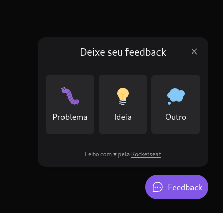

# NLW Return

> This is a little project made with Rocketseat. It is a little button on the bottom right corner that you can use to quickly send a feedback on something, optionally sending a screenshot of your browser page.



## Development

To run this project on dev mode, enter the server/ folder and type on your terminal:

``` sh
yarn # To install all the packages.
yarn dev # The server should be running.
```

Then go to to the web/ folder:

``` sh
yarn
yarn dev
```

Then access the localhost url and you can use it.

